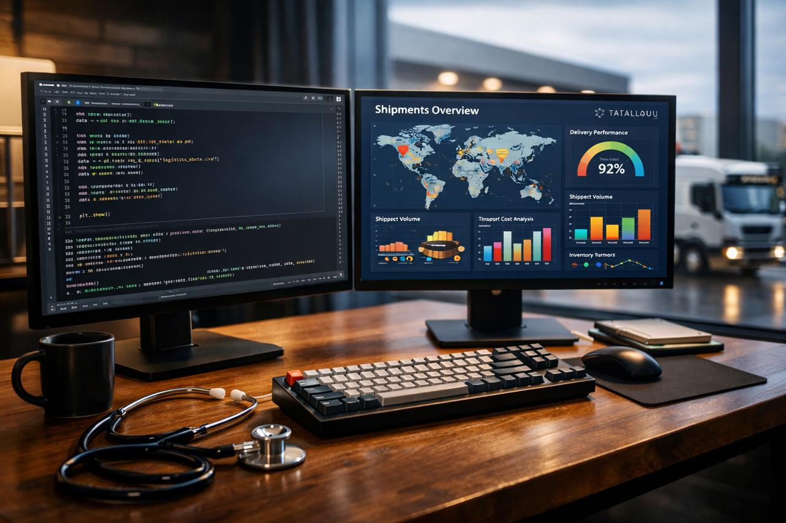

## <i class="fa-solid fa-people-arrows"></i> Un puente entre los negocios y la tecnología

Mi trayectoria profesional se define por la intersección de sectores críticos y la innovación digital. He gestionado licitaciones complejas, optimizado flujos de trabajo en almacenes y caminado por entornos médicos regulados. Hoy, fusiono esas experiencias operativas con mi capacidad técnica para resolver problemas reales.

---

### <i class="fa-solid fa-hand-holding-medical"></i> El Origen: Sector Salud y Regulaciones
Inicié mi carrera en el sector farmacéutico y médico, un entorno donde la precisión y el cumplimiento regulatorio son innegociables. Aprendí a moverme entre estrictas normativas y dispositivos médicos, entendiendo que cada dato representa un proceso crítico que impacta la salud y la operación.

### <i class="fa-solid fa-file-contract"></i> Visión Comercial y Estratégica
Mi paso por las ventas, tanto en el sector privado como en el gubernamental mediante **Compranet**, me otorgó una visión clara de cómo se cierran los negocios. Comprendo el ciclo completo: desde la identificación de la oportunidad hasta el cumplimiento técnico y la adjudicación de una licitación.

### <i class="fa-solid fa-gear"></i> La Transformación: Del "Dolor" a la Solución
Como estudiante de **Negocios Digitales** y graduado de **Data Analysis (TripleTen)**, decidí dejar de solo "vivir" los dolores operativos y logísticos para empezar a curarlos con tecnología. 

* **<i class="fa-brands fa-python"></i> Mi Enfoque:** Utilizar Python, SQL y Tableau para automatizar procesos manuales y extraer *insights* de negocio.
* **<i class="fa-solid fa-check-double"></i> Mi Metodología:** La agilidad. Como **Scrum Master**, creo en los procesos iterativos y en el valor constante para el equipo.

---

### <i class="fa-solid fa-rocket"></i> Lo que busco aportar
Estoy en constante aprendizaje, enfocando mis habilidades para integrarme como **Data Analyst** o **Scrum Master**. Mi objetivo es claro: transformar la complejidad operativa en claridad estratégica y valor de negocio.

> "No solo analizo datos; entiendo el negocio y la operación que los genera."

---

### <i class="fa-solid fa-industry"></i> Mi Ecosistema Profesional

{fig-align="center" width="100%"}

> Esta imagen simboliza la unión de la precisión médica, la complejidad logística y el poder de los datos en mi perfil profesional.

---

[<i class="fa-brands fa-linkedin"></i> Conecta conmigo en LinkedIn](https://www.linkedin.com/in/victorvazquez-dataanalyst){.btn .btn-primary .btn-sm} | [<i class="fa-brands fa-github"></i> Ver mi código](https://github.com/VictorVM-03){.btn .btn-outline-secondary .btn-sm}